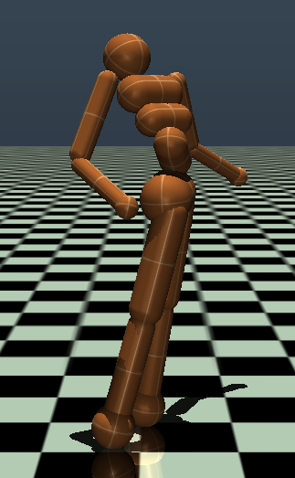

# Humanoid Control with PPO and Pose-Informed Initialization
*Project by: Anvay Joshi, Srikrishna Kidambi, Stany Cletus* 

This project demonstrates training a walking gait for a MuJoCo Humanoid robot using Proximal Policy Optimization (PPO) This is a form of Reinforcement Learning that works best with continuous action spaces, whereas Q Learning works well with discrete action spaces. Our project includes a pre-trained model and a pipeline to initialize the humanoid's starting pose based on keypoints extracted from a user-provided image.

## Results

<table>
  <tr align="center">
    <td><b>Input Image</b></td>
    <td><b>Skeleton Extraction</b></td>
    <td><b>Initial Humanoid Pose</b></td>
  </tr>
  <tr>
    <td></td>
    <td></td>
    <td></td>
  </tr>
  <tr align="center">
    <td>1. The input image provided to the model.</td>
    <td>2. The detected skeleton overlaid on the image.</td>
    <td>3. The humanoid's arms are set to the initial pose.</td>
  </tr>
</table>

## Demo

Below is a demonstration of the full pipeline, from pose initialization to the trained agent walking.


Note: A high clarity video is also available at `PPO-humanoid/demo.mp4`

## Features

- **Reinforcement Learning**: Utilizes PPO to train a `Humanoid-v5` agent from the Gymnasium environment.
- **Pose Initialization**: Extracts a 2D pose from an image using MediaPipe, converts it to 3D kinematic joint angles, and applies it to the humanoid's arms for a custom starting position.
- **Dynamic Stabilization**: Applies a dynamic forward force to the humanoid's shoulders, proportional to the agent's hip actions, to promote a stable, forward-leaning posture. ( This was done in addition to the model's forces because otherwise the humanoid looked like an "evil spirit" was pulling it from the hip forward 🩻)
- **Pre-trained Model**: Includes a `model.pt` file for immediate testing. (This model was trained for 1000 epochs and took quite long)
- **Comprehensive Training Script**: Provides a detailed training script (`train_ppo.py`) with hyperparameter tuning, logging via TensorBoard, and video recording of progress.

## Project Structure

```
/
├── lib/                    # Core PPO implementation
│   ├── agent_ppo.py        # PPO Actor-Critic agent architecture
│   ├── buffer_ppo.py       # Replay buffer for storing trajectories
│   └── utils.py            # Helper functions, argument parsing, env creation
├── pose_estimation/        # Human pose estimation pipeline
│   ├── imgAcquisition.py   # Image loading and preprocessing
│   ├── keyPointExtraction.py # 2D/3D keypoint extraction using MediaPipe
│   └── kinematicConversion.py # Conversion of keypoints to MuJoCo joint angles
├── checkpoints/            # Saved model checkpoints from training
├── logs/                   # TensorBoard logs for monitoring training
├── videos/                 # Rendered videos of agent performance
├── get_joint_data.py       # Utility script to inspect humanoid model joints
├── model.pt                # Pre-trained model file
├── req.txt                 # Python dependencies
├── test_ppo.py             # Script to test the pre-trained model with pose init
└── train_ppo.py            # Script to train a new model from scratch
```

## Setup and Installation

These instructions will guide you through setting up the project environment.

**1. Create a Virtual Environment**

It is crucial to use **Python 3.12**, as the MediaPipe library has specific compatibility requirements. Move into the PPO-Humanoid folder first.

```bash
# Create a virtual environment named 'venv'
cd PPO-Humanoid
python3.12 -m venv venv
```

**2. Activate the Virtual Environment**

-   On **Windows**:
    ```bash
    .\venv\Scripts\activate
    ```
-   On **macOS and Linux**:
    ```bash
    source venv/bin/activate
    ```

**3. Install Dependencies**

Install all the required Python packages from the `req.txt` file.

```bash
pip install -r req.txt
```

## How to Use

### Testing with a Custom Pose

You can run the pre-trained agent and initialize its starting arm pose from an image of a person.

**1. Prepare Your Image**

-   Place an image file (e.g., `my_pose.jpg`) into the root directory of this project (`PPO-Humanoid/`).
-   The image should clearly show a person's full body.

**2. Run the Test Script**

Execute the `test_ppo.py` script. It will prompt you to enter the filename of your image.

```bash
python test_ppo.py
```

The script will then:
-   Load your image and extract the pose.
-   Generate an `out.jpg` file showing the detected skeleton overlaid on your image.
-   Launch the MuJoCo simulation in a fullscreen window.
-   Set the humanoid's initial arm positions based on the detected pose.
-   Run the pre-trained PPO agent, which will attempt to make the humanoid walk.

### Training a New Model

You can train your own agent from scratch using the provided training script.

-   To start training, run `train_ppo.py`.
-   You can specify the number of epochs and other hyperparameters as command-line arguments.

**Example Training Command:**

This command will train the agent for 1000 epochs.

```bash
python train_ppo.py --n-epochs=1000
```

-   During training, progress will be logged to the `logs/` directory for TensorBoard and model checkpoints will be saved in `checkpoints/`.
-   You can monitor training by running TensorBoard: `tensorboard --logdir=logs`

## Detailed Pipeline Explanation

### 1. Pose Estimation (`pose_estimation/`)

This module is responsible for taking a static image and calculating a set of corresponding joint angles for the MuJoCo humanoid.

-   **`imgAcquisition.py`**: Contains functions to load an image from a file path and preprocess it (resize, normalize) for the pose detection model.
-   **`keyPointExtraction.py`**: Uses the **MediaPipe** library to detect a human pose in the preprocessed image. It extracts 33 keypoints (x, y, z, visibility) and then maps them to a 25-point skeleton structure similar to the BODY25 model. It also contains the logic to draw the final skeleton on the output image.
-   **`kinematicConversion.py`**: This is the core of the pose translation. It takes the 3D keypoints and uses inverse kinematics (trigonometry and `arctan2`) to calculate the corresponding joint angles (in radians) for the humanoid's torso, arms, and legs.

### 2. PPO Agent (`lib/`)

This directory contains the building blocks of the PPO algorithm.

-   **`agent_ppo.py`**: Defines the `PPOAgent` class, which is a PyTorch `nn.Module`. It contains two main components:
    -   **Actor**: A neural network that takes the environment state as input and outputs the mean (`mu`) of a probability distribution for the actions (joint torques). The standard deviation (`logstd`) is a separate trainable parameter, allowing the agent to control its exploration level.
    -   **Critic**: A neural network that estimates the value of a given state (i.e., the expected future reward).
-   **`buffer_ppo.py`**: Implements a `PPOBuffer` to store trajectories (state, action, reward, etc.) collected from the environment. It is also responsible for calculating the **Generalized Advantage Estimation (GAE)**, which is a key part of the PPO algorithm for determining how much better or worse an action was than the policy's average.
-   **`utils.py`**: Contains helper functions for parsing command-line arguments, creating Gymnasium environments, and logging videos of the agent's performance.

### 3. Training Pipeline (`train_ppo.py`)

This script orchestrates the entire training process.
1.  **Initialization**: It sets up vectorized environments to collect data from multiple simulations in parallel. It initializes the `PPOAgent`, optimizer (Adam), and a learning rate scheduler.
2.  **Data Collection**: In a loop, the agent interacts with the environments for a set number of steps (`n-steps`). All experiences are stored in the `PPOBuffer`.
3.  **Advantage Calculation**: Once the buffer is full, it uses the critic's value of the final state to calculate the advantages and returns for all stored steps.
4.  **Model Update**: The script then iterates over the collected data for a number of training iterations (`train-iters`). In each iteration, it computes the PPO loss function, which includes the clipped surrogate objective, a value function loss, and an entropy bonus (to encourage exploration).
5.  **Logging**: After each epoch, it logs all relevant metrics (losses, rewards, KL divergence) to TensorBoard and saves the model checkpoint.

### 4. Testing Pipeline (`test_ppo.py`)

This script demonstrates the final trained agent and integrates all components.
1.  **Pose Initialization**: It first calls the `pose_estimation` pipeline to get joint angles from a user-specified image. It then selectively applies only the **arm angles** to the humanoid's default starting `qpos` (joint positions). This provides a custom start without destabilizing the fragile walking posture.
2.  **Viewer Setup**: It customizes the simulation window to be fullscreen and sets the camera to a wide-angle tracking view for better observation.
3.  **Dynamic Force Application**: In the main simulation loop, it implements a stabilization strategy. It reads the agent's intended hip torques from the `action` vector and converts them into a dynamic **forward force** applied to the humanoid's shoulders. This counteracts a tendency for the upper body to lag behind the lower body, resulting in a more stable and natural-looking gait.
4.  **Execution**: The agent takes actions, the dynamic force is applied, the environment steps forward, and the result is rendered on screen until the episode ends.
